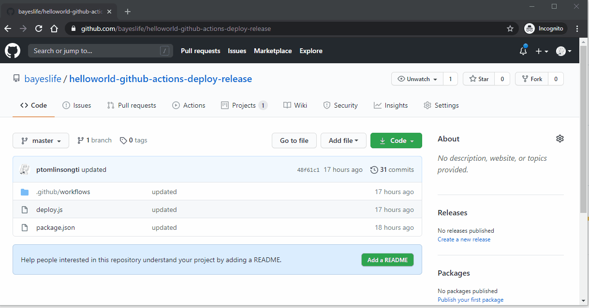

# Hello World GitHub Actions Deploy from Project Actions

This is an example demonstrating how it is possible to achieve deployment actions from activity on a github project board.

## Problem

During an SDLC it makes sense to build an artifact once and deploy the unchanged artefact through TEST, UAT, then PROD environments.
A mechanism is required to allow deployment into different environments by the stakeholders of those environments and have this be visible to others.

## Solution

Use the project board in the github repository.
Developer create a release card for each versioned release.
Testers can deploy into their environment by dragging that card to Test column in the project.
Likewise product owner can choose to drag that card into production to deploy that release to production.

## Detail

The github action workflow `main.yml`  listens for project card changes

```
on:
 project_card:
    types: [moved]
```

The steps which follow derive the card name and the project column.

As a result it is possible to trigger the deployment of a release to some environment if the card represented a release and the column represented a movement.
The product owner for instance could choose to move release 0.5.0 to test simply by moving the card.



## Next Steps

The deploy.js can be created as a library and made a dev dependency of the project.
This could be acheived via an [archetype](https://gitlab.com/phil8/archetype) such that it comes standard for the project with the rest of the tool chain.

